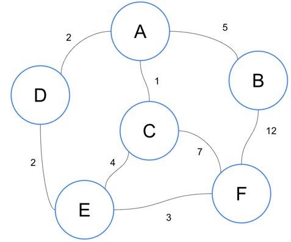

# 다익스트라

- 최단 경로 알고리즘의 일종

## 최단경로 알고리즘이란?
- 그래프에서 특정 정점에서 목적지까지 최단 경로를 구하는 알고리즘
- 이전에 배운 BFS, DFS도 최단 경로 알고리즘으로 사용할 수 있다.
- 대표적인 최단 경로 알고리즘으로 다음과 같은 알고리즘이 있다.
  - BFS
  - 다익스트라
  - 벨만-포드
  - 플로이드 와샬
- 목적에 따라 알고리즘을 선택할 수 있다.

## 다익스트라가 사용되는 경우

- 간선의 가중치가 있는 경우
- BFS, DFS는 그래프의 간선 가중치가 모두 같을 때 적합하다.
  - 2차원 배열(지도) 입력이 주어진 상태로 최단 거리를 찾아야 한다면 BFS, DFS로 푸는 경우가 많다.

## 그렇다면 다익스트라 알고리즘이란 무엇인가?
- Edsger Wybe Dijkstra가 고안한 최단 경로 알고리즘
- 우선순위 큐를 이용하여 만들 수 있다.
- 시간복잡도는 V가 정잠의 수 E가 간선의 수일때 O(E log V)다.

## 알고리즘 순서
1. 시작점을 제외한 모든 정점의 거리를 무한으로 초기화한다. 시작점은 0으로 초기화한다.
2. 시작점을 선택한다.
3. 선택한 정점에서 갈 수 있는 거리를 정점(해당 정점까지의 최단 거리) 값 + 간선(거리) 값으로 갱신한다.
4. 선택한 정점을 방문 처리한다.
5. 이미 방문한 정점과 거리가 무한인 정점을 제외하고 최단거리인 정점을 선택한다.
6. 더 이상 방문할 정점이 없을 때 까지 3 ~ 5를 반복한다.
7. 도착점의 값을 확인한다.

## 예시

1. 시작점을 제외한 간선의 거리르 모두 무한으로 초기화한다. 시작점은 0으로 초기화한다.

| A | B | C | D | E | F |
| :-: | :-: | :-: | :-: | :-: | :-: |
| 0 | ∞ | ∞ | ∞ | ∞ | ∞ |

2. 그 후 시작점에서 갈 수 있는 정점을 찾습니다. -> D, C, B
3. 각 정점의 가중치를 더합니다.

| A | B | C | D | E | F |
| :-: | :-: | :-: | :-: | :-: | :-: |
| 0 | 5 | 1 | 2 | ∞ | ∞ |

4. 이미 방문한 정점(A)와 무한으로 초기화된 정점을 제외한 정점 죽 가중치가 가장 작은 정점을 선택합니다. -> C
5. C에서 갈 수 있는 정점 E, F를 찾아서 C의 가중치와 E, F 가중치를 각각 더합니다.

| A | B | C | D | E | F |
| :-: | :-: | :-: | :-: | :-: | :-: |
| 0 | 5 | 1 | 2 | 5 | 8 |

6. C는 방문처리하고, C를 제외한 작은 값인 D를 선택합니다.
7. D에서 갈 수 있는 정점 E의 가중치를 계산하면 4이므로, 가중치의 합이 더 적기 때문에 5 -> 4 로 갱신합니다.

| A | B | C | D | E | F |
| :-: | :-: | :-: | :-: | :-: | :-: |
| 0 | 5 | 1 | 2 | 4 | 8 |

8. D가 방문처리 되고, 다음으로 가중치가 더 낮은 E가 선택됩니다.
9. E에서 가는 정점은 F밖에 없으므로 F의 가중치를 계산하면 더 낮기때문에 갱신합니다.

| A | B | C | D | E | F |
| :-: | :-: | :-: | :-: | :-: | :-: |
| 0 | 5 | 1 | 2 | 4 | 7 |

10. 도착점을 제외한 마지막 정점이 B를 선택합니다.
11. B에서 갈 수 있는 정점이 F밖에 없지만, 가중치가 더 높으므로 갱신하지 않고 끝이납니다.
12. F의 도착점의 최소 간선은 7입니다.

[🏠 홈으로](/README.md) 